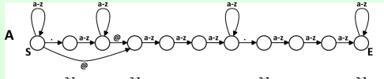
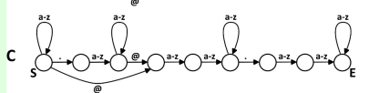
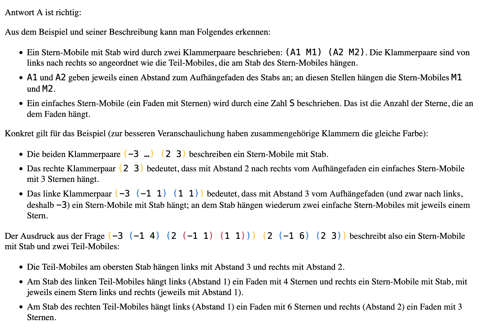
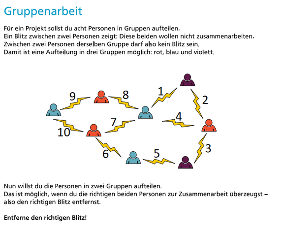
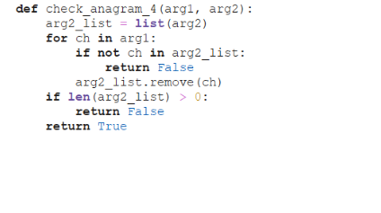

<div class="flex flex-row flex-wrap justify-end items-center gap-8 mt-0">
    <a href="https://www.ocg.at/"></a>
    <a href="https://bmb.gv.at/"></a>
</div>

# JIW Lösungen - Oberstufe 2025

## Frage 1


## Frage 1 - Lösung

Die richtige Antwort ist:\


Diese Struktur ermöglicht beide formen von E-Mail-Adressen.

Lösungsstrategie durch Ausschluss:

A und C sind unter anderem falsch, da sie auch nichts ("") als ersten Buchstaben vor dem Punkt
erlauben. Also wäre `.V@W.X` auch gültig.





D ist zwar ähnlich zu B, aber erlaubt für **X** nur 3 oder mehr Buchstaben,
obwohl 2 auch gültig sein sollten.


## Frage 2


### Lösung



## Frage 3



### Lösung

Der richtige Blitz ist Blitz 4


## Frage 4

Welches Turtle-Programm zeichnet diese Figur:


### Lösung

Richtig war nur das Programm hier rechts. Die anderen drei Programme
hätten folgende Bilder gezeichnet:

- Ungleichmäßige Abstände zwischen den Zacken (fd(15) und fd(5))
- Das gleiche Muster aber gespiegelt (wie ein L, statt J, wegen lt(30)
  statt rt(30))
- Beides der oberen.


## Frage 5

Welches Mandala wird von dem Programm gezeichnet?


### Lösung

Das Mandala rechts wird vom Programm gezeichnet.

- Die grünen Striche am Ende sind um 45 Grad nach rechts geneigt. Das
  ergibt sich aus:
  ```python
  rt(45) + 2 \* lt(90) + rt(180)
  ```
- Quadratische Diamanten werden gezeichnet, kein Hexagon
- Die richtigen Farben werden verwendet

Bei allen anderen Antwortmöglichkeiten weicht zumindest eine dieser
Eigenschaften ab.

## Aufgabe 6

Beim Bearbeiten von Wörtern sind folgende Operationen möglich:

Einfügen:   socken → stocken\
Entfernen:  traube → taube\
Ändern:     tinte → tante

Die obigen Wörter haben alle eine sogenannte Edit-Distanz von 1

**Was ist die Edit-Distanz der 2 Wörter?**

Wie viele der oben genannten Operationen sind also notwendig um das eine
Wort in das andere zu überführen?

strassenbahn\
wasserschaden


### Lösung

Die richtige Antwort ist 7

Zuerst müssen wir die beiden Wörter optimal ausrichten, also so, dass
möglichst viele Buchstaben übereinstimmen. Dazu können wir vorerst ein
paar leere Felder (\_) einfügen. Bei der "optimalen Ausrichtung" stimmen
6 der Buchstaben schon überein

<p class="font-mono">
str<b>asse</b>nba<b>h</b>___<b>n</b> <br/>
w__<b>asse</b>rsc<b>h</b>ade<b>n</b>
</p>

Nun können wir einfach die weiters notwendigen Operationen anwenden.
Dafür wählen wir eines der Wörter, z.B. das zweite, `w__asserschaden`.


Änderungen von links nach rechts:

`w` &rarr;  `s` (Änderung)

`_` &rarr;  `t` (Hinzufügen)

`_` &rarr;  `r` (Hinzufügen)

Es folgen die übereinstimmenden Buchstaben **asse**

`r` &rarr;  `n` (Änderung)

`s` &rarr;  `b` (Änderung)

`c` &rarr;  `a` (Änderung)

Es folgt der übereinstimmende Buchstabe **h**

`a` (Entfernung)

`d` (Entfernung)

`e` (Entfernung)

Zum Schluss noch der übereinstimmende Buchstabe `n`

Wir erhalten das Wort `strassenbahn` nach 7 Operationen.

## Aufgabe 7 & Lösung

Ein Anagramm ist ein Wort, das aus den Buchstaben eines anderen Wortes
gebildet wird. Nur die Reihenfolge ändert sich.

Alle Buchstaben müssen verwendet werden, keiner darf dazukommen oder
fehlen.

Beispiele:

regal → lager

anna → nana

Welche der folgenden Funktionen erkennt Anagramme korrekt?

Die richtige Antwort ist:


Beide Wörter werden sortiert und verglichen. Das stellt sicher, dass:

- Beide Wörter gleich lang sind.
- Jeder Buchstabe gleich oft vorkommt, da in diesem Fall bei den
  sortierten Wörtern jeder Buchstabe genau an der gleichen stelle
  vorkommt

## Aufgabe 9 & Lösung

Ein Anagramm ist ein Wort, das aus den Buchstaben eines anderen Wortes
gebildet wird. Nur die Reihenfolge ändert sich.

Alle Buchstaben müssen verwendet werden, keiner darf dazukommen oder
fehlen.

Beispiele:

regal → lager\
anna → nana

Die folgenden Funktionen sollen Anagramme erkennen, allerdings sind
nicht alle korrekt. Welche Aussagen sind korrekt?

Antwort:\
**check_anagram_4** und **check_anagram_6** sind beide korrekt.




Dieser Ansatz prüft, ob jeder Buchstabe aus dem ersten Wort im zweiten
Wort "gefunden und verbraucht" werden kann.


- **Vorbereitung:** arg2 wird in eine veränderbare Liste (arg2_list) umgewandelt.
- **Ablauf:** Die Funktion geht jeden Buchstaben von arg1 durch:
  - **Prüfung:** Kommt der aktuelle Buchstabe in der arg2_list vor?
  - **Nein:** Abbruch mit False (Buchstabe fehlt).
  - **Ja:** Der Buchstabe wird **einmal** aus arg2_list entfernt, um
    sicherzustellen, dass Anzahl der Vorkommen des Buchstaben auch
    übereinstimmen.
- **Endergebnis:** Nach der Schleife wird geprüft, ob arg2_list leer
  ist.
  - Falls noch Buchstaben übrig sind (Länge \> 0): False (Wort 2 war
    länger oder hatte überschüssige Buchstaben).
  - Falls leer: True.

Das Verfahren gibt nur dann True zurück, wenn beide Wörter aus exakt
denselben Buchstaben in identischer Anzahl bestehen, also Anagramme
sind.

Dieser Ansatz vergleicht die Anzahl jedes einzelnen Buchstabens
(Häufigkeitsanalyse) mittels einer \"Nullsummen\"-Logik.

- **Vorbereitung:** Eine Liste (count_list) mit 26 Nullen wird erstellt
  -- eine Position für jeden Buchstaben des Alphabets.
- **Hochzählen (arg1):** Für jeden Buchstaben in arg1 (also Wort 1) wird
  der entsprechende Zähler in der Liste um **1** erhöht (z. B. \"b\"
  erhöht Index 1).
- **Runterzählen (arg2):** Für jeden Buchstaben in arg2 (also Wort 2)
  wird der Zähler anschließend an der gleichen Stelle um **1**
  verringert.
- **Endergebnis:** Die Funktion prüft, ob **alle** Einträge in der Liste
  wieder **0** sind.
  - Ist auch nur eine Zahl ungleich 0 (positiv oder negativ): False.
  - Sind alle 0: True.

Dies stellt sicher, dass die Funktion True liefert, wenn die Häufigkeit
jedes einzelnen Buchstabens in Wort 1 exakt mit der in Wort 2
übereinstimmt, also dass die Wörter Anagramme sind.

## Aufgabe 10


### Lösung

Die richtige Lösung ist: **A5 B4 C3 D1**


A: Er färbt das Feld in der Farbe des Punktes, der ihm am nächsten
liegt.\
Das ist bei Bild 5 der Fall. Jeder Punkt hat ein Feld um sich herum in
seiner eigenen Farbe, welches endet, wenn ein anderer Punkt näherkommt
als er selbst.


B: Er färbt das Feld in der Farbe des Punktes, der am weitesten entfernt
ist.

Das ist bei Bild 4 der Fall. Die Punkte am Rand verursachen ein Feld im
gegenüberliegenden Teil des Bodens. Der pinke Punkt rechts unten zum
Beispiel, sorgt für ein großes Pinkes Feld links oben.


C: Er färbt das Feld in der Farbe des Punktes, der ihm am zweitnächsten
liegt.

Das ist bei Bild 3 der Fall. Beispielsweise sieht man, dass die drei
Punkte oben, blau, weiß und blau, den Boden genau umgekehrt einfärben
(um den weißen Punkt ist der Boden blau, um die blauen Punkte Großteils
weiß)


D: Er betrachtet die 3 ihm am nächsten liegenden Punkte, und wählt die
Farbe, die darin am häufigsten vorkommt. Bei Gleichstand (jeder der 3
Punkte hat eine andere Farbe) färbt er das Feld weiß.

Das ist bei Bild 1 der Fall. In der rechten Hälfte finden sich sechs
Punkte, wobei nur 2 von ihnen die gleiche Farbe haben (dunkelblau). Das
ist jedoch auch zu wenig, dass hier eine Farbe "gewinnt". Deshalb ist
die richte Hälfte Großteils weiß (kein Sieger).

Links unten gibt es 2 gelbe Punkte, die recht nah aneinander sind. Sie
konnten um sich herum den pinken Punkt überstimmen und der Boden wurde
gelb

## Aufgabe 11

Welche Grafik wird durch das Programm erzeugt?


### Lösung

Die richtige Antwort ist:


Das ergibt sich aus Ablesen der Werte. Die positiven Werte zeigen nach
oben, die negativen nach unten, und dass bei den Balken von links nach
rechts. Bei allen anderen Bildern war die Länge der Balken falsch oder
sie zeigten in die falsche Richtung.
